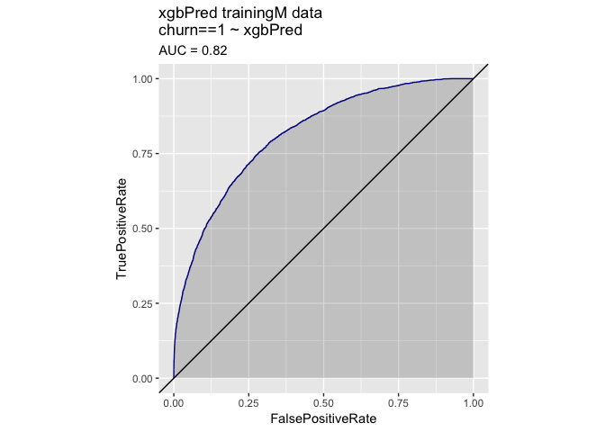

KDD2009vtreat
================
John Mount

Practical data science with R built chapter 6 built a number of single variable models. In Listing 6.11 it used an ad-hoc entropy based out of sample effect size estimate for variable selection. This likely (though it isn't completely rigorous) picked variables conservatively.

We show here how to repeat this work on the KDD2009 dataset using more standard techniques more quickly. For vtreat details see: <http://www.win-vector.com/blog/2014/08/vtreat-designing-a-package-for-variable-treatment/> and Chapter 6 of Practical Data Science with R: <http://www.amazon.com/Practical-Data-Science/dp/1617291560> For details on data see: <https://github.com/WinVector/zmPDSwR/tree/master/KDD2009> There is an issue that any data row used to build the single variable models isn't exchangable with future unseen rows for the purposes of scoring and training. So the most hygienic way to work is to use one subset of data to build the single variable models, and then another to built the composite model, and a third for scoring. In particular models trained using rows used to build sub-models think the sub-models have large effects that the sub-models will in the future, and under-estimate degrees of freedom of complicated sub-models.

``` r
date()
```

    ## [1] "Mon Dec 17 09:52:25 2018"

``` r
#load some libraries
library('vtreat')
packageVersion("vtreat")
```

    ## [1] '1.3.3'

``` r
library('WVPlots') 

library('parallel')
library('xgboost')


# load the data as in the book
# change this path to match your directory structure
#dir = '~/Documents/work/PracticalDataScienceWithR/zmPDSwR/KDD2009/' 
dir = '~/Documents/work/zmPDSwR/KDD2009/' 


d = read.table(paste(dir,'orange_small_train.data.gz',sep=''),
                header=T,sep='\t',na.strings=c('NA',''), 
               stringsAsFactors=FALSE)
churn = read.table(paste(dir,'orange_small_train_churn.labels.txt',sep=''),
                    header=F,sep='\t')
d$churn = churn$V1
appetency = read.table(paste(dir,'orange_small_train_appetency.labels.txt',sep=''),
                        header=F,sep='\t')
d$appetency = appetency$V1
upselling = read.table(paste(dir,'orange_small_train_upselling.labels.txt',sep=''),
                        header=F,sep='\t')
d$upselling = upselling$V1
set.seed(729375)
d$rgroup = runif(dim(d)[[1]])
dTrain = subset(d,rgroup<=0.9)  # set for building models and impact coding
dTest = subset(d,rgroup>0.9) # set for evaluation
rm(list=c('d','churn','appetency','upselling','dir'))

dim(dTrain)
```

    ## [1] 45028   234

``` r
dim(dTest)
```

    ## [1] 4972  234

``` r
outcomes = c('churn','appetency','upselling')
vars = setdiff(colnames(dTrain),
                c(outcomes,'rgroup'))
yName = 'churn'
yTarget = 1

set.seed(239525)

ncore <- parallel::detectCores()
cl = parallel::makeCluster(ncore)
date()
```

    ## [1] "Mon Dec 17 09:52:31 2018"

``` r
date()
```

    ## [1] "Mon Dec 17 09:52:31 2018"

``` r
var_values <- vtreat::value_variables_C(dTrain,
    vars,yName,yTarget,
    smFactor=2.0, 
    parallelCluster=cl
    )
summary(var_values$sig < 1/nrow(var_values))
```

    ##    Mode   FALSE    TRUE 
    ## logical      59     153

``` r
vars <- var_values$var[var_values$sig < 1/nrow(var_values)]


date()
```

    ## [1] "Mon Dec 17 09:54:56 2018"

``` r
date()
```

    ## [1] "Mon Dec 17 09:54:56 2018"

``` r
# Run other models (with proper coding/training separation).
#
# This gets us back to AUC 0.72 range

customCoders = list('c.PiecewiseV.num' = vtreat::solve_piecewise,
                    'n.PiecewiseV.num' = vtreat::solve_piecewise,
                    'c.knearest.num' = vtreat::square_window,
                    'n.knearest.num' = vtreat::square_window)
                   # 'n.poolN.center' = vtreat::ppCoderN, 
                   # 'c.poolC.center' = vtreat::ppCoderC)
                   # 'n.NonDecreasingV.num' = vtreat::solveNonDecreasing,
                   # 'n.NonIncreasingV.num' = vtreat::solveNonIncreasing, 
                   # 'c.NonDecreasingV.num' = vtreat::solveNonDecreasing,
                   # 'c.NonIncreasingV.num' = vtreat::solveNonIncreasing)
cfe = mkCrossFrameCExperiment(dTrain,
                              vars,yName,yTarget,
                              customCoders=customCoders,
                              smFactor=2.0, 
                              parallelCluster=cl)
```

    ## [1] "vtreat 1.3.3 start initial treatment design Mon Dec 17 09:54:56 2018"
    ## [1] " start cross frame work Mon Dec 17 09:56:44 2018"
    ## [1] " vtreat::mkCrossFrameCExperiment done Mon Dec 17 09:57:31 2018"

``` r
treatmentsC = cfe$treatments
scoreFrame = treatmentsC$scoreFrame
selvars <- scoreFrame$varName
treatedTrainM <- cfe$crossFrame[,c(yName,selvars),drop=FALSE]
treatedTrainM[[yName]] = treatedTrainM[[yName]]==yTarget

treatedTest = prepare(treatmentsC,
                      dTest,
                      pruneSig=NULL, 
                      varRestriction = selvars,
                      parallelCluster=cl)
treatedTest[[yName]] = treatedTest[[yName]]==yTarget

# prepare plotting frames
treatedTrainP = treatedTrainM[, yName, drop=FALSE]
treatedTestP = treatedTest[, yName, drop=FALSE]
date()
```

    ## [1] "Mon Dec 17 09:57:32 2018"

``` r
date()
```

    ## [1] "Mon Dec 17 09:57:32 2018"

``` r
mname = 'xgbPred'
print(paste(mname,length(selvars)))
```

    ## [1] "xgbPred 663"

``` r
params <- list(max_depth = 5, 
              objective = "binary:logistic",
              nthread = ncore)
model <- xgb.cv(data = as.matrix(treatedTrainM[, selvars, drop = FALSE]),
                label = treatedTrainM[[yName]],
                nrounds = 400,
                params = params,
                nfold = 5,
                early_stopping_rounds = 10,
                eval_metric = "logloss")
```

    ## [1]  train-logloss:0.503590+0.000296 test-logloss:0.504613+0.000526 
    ## Multiple eval metrics are present. Will use test_logloss for early stopping.
    ## Will train until test_logloss hasn't improved in 10 rounds.
    ## 
    ## [2]  train-logloss:0.400950+0.000437 test-logloss:0.402854+0.001203 
    ## [3]  train-logloss:0.339250+0.000538 test-logloss:0.341988+0.001565 
    ## [4]  train-logloss:0.300386+0.000648 test-logloss:0.304047+0.001891 
    ## [5]  train-logloss:0.275246+0.000784 test-logloss:0.279943+0.001939 
    ## [6]  train-logloss:0.258856+0.000748 test-logloss:0.264548+0.002174 
    ## [7]  train-logloss:0.247770+0.000777 test-logloss:0.254923+0.002358 
    ## [8]  train-logloss:0.240037+0.000693 test-logloss:0.248399+0.002481 
    ## [9]  train-logloss:0.234671+0.000673 test-logloss:0.244351+0.002548 
    ## [10] train-logloss:0.230475+0.000679 test-logloss:0.241875+0.002567 
    ## [11] train-logloss:0.227133+0.000709 test-logloss:0.240053+0.002580 
    ## [12] train-logloss:0.224406+0.000616 test-logloss:0.238973+0.002705 
    ## [13] train-logloss:0.222174+0.000398 test-logloss:0.238390+0.002811 
    ## [14] train-logloss:0.220256+0.000706 test-logloss:0.238088+0.002829 
    ## [15] train-logloss:0.218391+0.000730 test-logloss:0.237736+0.002827 
    ## [16] train-logloss:0.216649+0.000631 test-logloss:0.237494+0.002567 
    ## [17] train-logloss:0.214895+0.000735 test-logloss:0.237120+0.002623 
    ## [18] train-logloss:0.213627+0.000668 test-logloss:0.237178+0.002502 
    ## [19] train-logloss:0.212228+0.000692 test-logloss:0.237260+0.002668 
    ## [20] train-logloss:0.210803+0.000478 test-logloss:0.237338+0.002434 
    ## [21] train-logloss:0.209531+0.000570 test-logloss:0.237388+0.002441 
    ## [22] train-logloss:0.208480+0.000776 test-logloss:0.237584+0.002538 
    ## [23] train-logloss:0.207152+0.000677 test-logloss:0.237514+0.002911 
    ## [24] train-logloss:0.206302+0.000536 test-logloss:0.237419+0.002924 
    ## [25] train-logloss:0.205124+0.000668 test-logloss:0.237467+0.002913 
    ## [26] train-logloss:0.203800+0.000626 test-logloss:0.237774+0.002924 
    ## [27] train-logloss:0.202944+0.000868 test-logloss:0.237833+0.002815 
    ## Stopping. Best iteration:
    ## [17] train-logloss:0.214895+0.000735 test-logloss:0.237120+0.002623

``` r
nrounds <- model$best_iteration
print(paste("nrounds", nrounds))
```

    ## [1] "nrounds 17"

``` r
model <- xgboost(data = as.matrix(treatedTrainM[, selvars, drop = FALSE]),
                 label = treatedTrainM[[yName]],
                 nrounds = nrounds,
                 params = params)
```

    ## [1]  train-error:0.072533 
    ## [2]  train-error:0.072755 
    ## [3]  train-error:0.072755 
    ## [4]  train-error:0.072733 
    ## [5]  train-error:0.072644 
    ## [6]  train-error:0.072733 
    ## [7]  train-error:0.072910 
    ## [8]  train-error:0.072733 
    ## [9]  train-error:0.072799 
    ## [10] train-error:0.072755 
    ## [11] train-error:0.072755 
    ## [12] train-error:0.072311 
    ## [13] train-error:0.072222 
    ## [14] train-error:0.071600 
    ## [15] train-error:0.071644 
    ## [16] train-error:0.071489 
    ## [17] train-error:0.071222

``` r
treatedTrainP[[mname]] = predict(model, 
                                 newdata=as.matrix(treatedTrainM[, selvars, drop = FALSE]), 
                                 type='response')
treatedTestP[[mname]] = predict(model,
                                newdata=as.matrix(treatedTest[, selvars, drop = FALSE]), 
                                n.trees=nTrees)
date()
```

    ## [1] "Mon Dec 17 09:59:02 2018"

``` r
date()
```

    ## [1] "Mon Dec 17 09:59:02 2018"

``` r
t1 = paste(mname,'trainingM data')
print(DoubleDensityPlot(treatedTrainP, mname, yName, 
                        title=t1))
```


``` r
print(ROCPlot(treatedTrainP, mname, yName, yTarget,
              title=t1))
```



``` r
print(WVPlots::PRPlot(treatedTrainP, mname, yName, yTarget,
              title=t1))
```


``` r
t2 = paste(mname,'test data')
print(DoubleDensityPlot(treatedTestP, mname, yName, 
                        title=t2))
```


``` r
print(ROCPlot(treatedTestP, mname, yName, yTarget,
              title=t2))
```


``` r
print(WVPlots::PRPlot(treatedTestP, mname, yName, yTarget,
              title=t2))
```


``` r
print(date())
```

    ## [1] "Mon Dec 17 09:59:04 2018"

``` r
print("*****************************")
```

    ## [1] "*****************************"

``` r
date()
```

    ## [1] "Mon Dec 17 09:59:04 2018"

``` r
if(!is.null(cl)) {
    parallel::stopCluster(cl)
    cl = NULL
}
```
